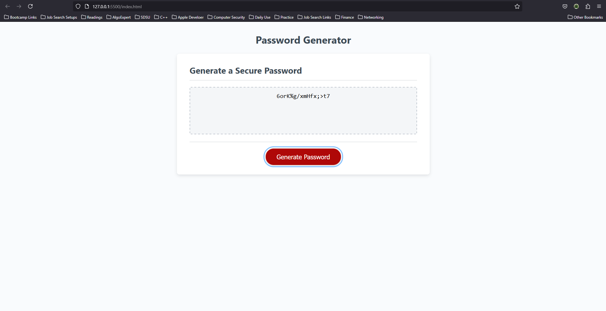

# 🔐 Random Password Generator

A simple and secure JavaScript-based password generator that allows users to create strong, customizable passwords. The application prompts users to specify the desired password length and character types (lowercase, uppercase, special characters, and numbers), then generates a random password based on the selected criteria.

## 🌟 Features

- Choose password length (8 to 128 characters)
- Include/exclude:
  - ✅ Lowercase letters
  - ✅ Uppercase letters
  - ✅ Numbers
  - ✅ Special characters
- Guaranteed to include at least one character from each selected category
- Easy-to-use interface with responsive design
- Fully client-side – no data is stored or transmitted

## 🚀 Live Demo

👉 [View the deployed app here](https://mnoorzai21.github.io/password-generator-mnn/)

## 📂 GitHub Repository

🔗 [Visit the GitHub repo](https://github.com/mnoorzai21/password-generator-mnn)

## 🛠️ Built With

- HTML5
- CSS3
- JavaScript (Vanilla)

## 📸 Screenshot

 <!-- Add screenshot to assets folder -->

## 📋 Usage

1. Click the **Generate Password** button.
2. Follow the prompts to:
   - Choose password length (must be between 8 and 128).
   - Select which character types to include.
3. Your password will appear in the display box.

## 💡 Future Enhancements

- Add copy-to-clipboard button
- Include password strength indicator
- Dark mode toggle
- Save generated passwords (locally)

## 🧑‍💻 Author

**Mohammad Nabi Noorzai**  
📧 [Email](mailto:mnoorzai21@gmail.com)  
🌐 [Portfolio (coming soon!)]()

---

